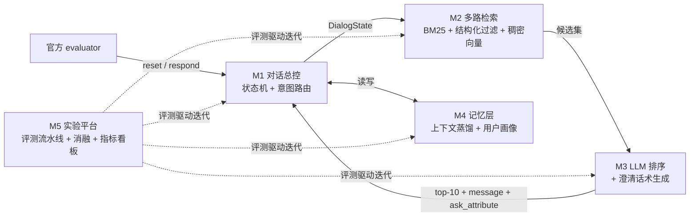

# Shopping Copilot — 技术方案 Spec（v0.1 讨论稿）

> 状态：开发中。**§5 接口已于 2026-08-29 定稿**（按 M1 打样代码现状核定）；其余章节仍为讨论稿。
> 配套文档：[problem-statement.md](problem-statement.md)（题目精简版）、[分工计划.md](分工计划.md)
> 事实来源：官方仓库 https://github.com/TechJam2026/techjam-conversational-search （README、docs/competition_specification.md、docs/agent_api_contract.json、evaluator 源码）

---

## 1. 目标与非目标

**目标（按优先级）**
1. 在官方本地评测器上，**TechnicalScore 显著超过 baseline 的 0.107**（内部阶梯目标见 §7）。
2. 系统结构清晰地体现题目四大支柱（意图路由 / 状态机 / 上下文蒸馏 / 指标驱动），这直接对应题目评分表里 35% 的 Technical Execution 和 20% 的 Innovation（TechnicalScore 只是 Technical Execution 的客观输入，不是全部）。
3. **离线也能跑**：官方最终评测可能**禁用网络**，必须有不依赖外部 API 的降级路径。
4. 交付物完整：公开仓库 + README + 报告 + demo 视频 + Devpost。

**非目标（明确不做）**
- ❌ UI/前端（纯后端评测）
- ❌ 训练/微调基座模型
- ❌ 外部向量数据库（必须全内存）
- ❌ 多模态（纯文本）

---

## 2. 官方评测机制（我们在玩什么游戏 — 全组必读）

这是调研官方仓库后确认的**关键事实**，所有设计决策都从这里推导：

### 2.1 接口（docs/agent_api_contract.json）
我们只需要实现一个 Python 类，两个方法：

```python
class Agent:
    def reset(self, session_id: str, user_profile: dict) -> None: ...
    # user_profile 固定 5 个键: purchase_frequency, average_prior_rating,
    #                         rating_style, preference_tags, summary

    def respond(self, session_id: str, user_message: str, turn: int, top_k: int) -> dict: ...
    # 返回: {
    #   "message": str,                    # 给用户看的自然语言
    #   "ask_attribute": str | None,       # 枚举: category/material/color/size/style/
    #                                      #       brand/budget/feature/use_case/other
    #   "recommendations": [{"parent_asin": str, "score": float?}, ...],  # 按好到差排序
    #   "usage": {"prompt_tokens": int, "completion_tokens": int}?        # 可选
    # }
```

- `turn` 为 1..10，`top_k` 恒为 10；只有**前 10 个合法且去重的 parent_asin** 被打分，score 字段被忽略——**排序就是一切**。
- **本地**评测器把抛异常/非法输出当成空响应（等于浪费一轮）；但官方规则写明正式评测中异常、非法输出、**超时**都可能直接记为 miss，且本地不模拟超时——代码必须稳，延迟也要盯。

### 2.2 判分（docs/evaluation_config.json）

```
TechnicalScore = 0.50 × HitRate@10 + 0.30 × MRR + 0.20 × Efficiency
Efficiency     = clip((11 − MTTC) / 10, 0, 1)      # miss 的 session 按第 11 轮记
```

命中 = 目标商品的 parent_asin **精确匹配**出现在当轮 top-10 → session 立即成功结束。
Baseline（弱 BM25，从不提问、无状态）：HitRate 0.125 / MRR 0.068 / TechnicalScore **0.107**。空间巨大。

### 2.3 四种场景（公私集比例相同）

| 场景 | 占比 | 行为 |
|---|---|---|
| **Buying** | 40% | 首条消息就透露一个硬约束 → **第 1 轮就可能命中** |
| **Browsing** | 40% | 首条消息模糊（"I'm looking for X, but I'm still exploring."）→ 靠提问收敛 |
| **Intent Override** | 15% | 第 3 或 4 轮说 "Actually, ignore my earlier preference. What I need is: …" → **在此之前不可能命中**，必须擦槽重写 |
| **Boundary** | 5% | 对被问属性回答 "I don't have a preference" → 要能优雅兜底（源码确认：只有**第一次**提问被这样挡掉，之后恢复正常吐约束，可以继续问） |

### 2.4 模拟器的回复策略是公开且确定性的（我们最大的信息优势）

evaluator 源码公开，模拟用户的应答规则可以直接研究：
- `ask_attribute = null` 时用户只回一句废话（"Ask me about one specific attribute."）→ **提问时永远不要传 null**。
- 问中一个匹配的属性 → 用户**原文吐出最多 2 条**未透露的意图卡约束（"For that, what matters is: …"）。
- `"other"` 能匹配任意剩余约束，是**强力兜底提问**。
- 意图卡由目标商品元数据生成：正则提取材质（cotton/leather/wool 等 9 种）、11 种基础颜色（12 个正则项，gray/grey 同色）、"budget around $价格"。我们的解析器可以针对这些格式精确设计。

### 2.5 其他硬规则
- 每轮**既可以提问也可以同时给推荐**，两者不冲突 → **每一轮都必须携带当前最优 top-10**（推荐无成本，命中即赢）。
- 评测器硬编码 `from starter.agent import Agent` → 入口文件位置固定，**绝不允许改 evaluator**。
- 公开集 200 条含 ground truth；题目文档说明私有集 800 条使用**不同的用户和目标商品**（但共用同一个 5 万商品目录、场景比例相同）→ **警惕过拟合公开集**，做通用策略而不是逐样本 hack。
- token 用量/延迟/成本需要披露（属 Feasibility 评分项，不进 TechnicalScore）。

---

## 3. 系统架构



**一轮的数据流**：`respond()` 进来 → M1 更新状态（填槽/擦槽/场景判断）→ M2 按当前约束多路检索出候选 → M3 排序出 top-10、必要时生成澄清问题 → M1 决策（问什么属性）并组装响应。全程内存内，无外部存储。

---

## 4. 模块规格

### M1 对话总控 & 状态机（对应支柱 I 路由 + II 状态机）
- **职责**：Agent 入口类；槽位状态机（增量填槽、Override 擦槽重写、Boundary 兜底）；Buying/Browsing 双轨判断；**提问策略**（本轮问哪个 `ask_attribute` 信息增益最大，`other` 兜底；已问过的不重复问）。
- **关键逻辑**：检测 "Actually, ignore my earlier preference" 类改写信号；解析 "For that, what matters is: …" 格式的约束吐露；候选池过载时（M2 报告候选>阈值）触发主动澄清。
- **验收**：Intent Override 场景分项指标不为 0；Boundary 场景不崩溃；每轮响应合法（永不抛异常）。

### M2 多路检索（对应支柱 I 混合管线）
- **职责**：catalog.jsonl 加载与索引（启动一次，全内存）；三条路——①改良 BM25/FTS5 关键词路（查询扩展、字段加权）②结构化过滤路（price 区间、categories、details 里的 Brand/Color/Size/Material）③稠密向量路（预计算 50k 商品 embedding，内存 numpy 矩阵，余弦检索）；多路融合（RRF 或加权）+ 动态截断。
- **约束**：50k × 384 维 float32 ≈ 73MB，内存完全放得下；embedding 预计算好随包提交，运行期**不依赖网络**。
- **验收**：单独测 Recall@100（目标商品是否进候选集）——这是全系统天花板，优先保召回。

### M3 LLM 排序 & 生成（对应支柱 I 的 LLM Ranking + II 主动引导）
- **职责**：把 M2 的候选集（约 30–100 条）连同蒸馏后的对话上下文交给 LLM 精排出 top-10；生成自然的澄清 `message`；**离线降级路径**：无网络时用本地打分函数（约束匹配数 + 检索融合分 + rating 先验）代替 LLM。
- **约束**：LLM 选型待全组定（§9）；统计并上报 usage tokens；延迟可控（10 轮 × 200 sessions 的本地评测要能在合理时间跑完）。
- **验收**：LLM 精排相对纯检索排序在 MRR 上有可量化提升（消融实验证明）；断网跑评测器不报错。

### M4 记忆 & 上下文蒸馏（对应支柱 III 自我进化）
- **职责**：把逐轮增长的原始对话蒸馏成紧凑的结构化上下文（当前约束清单 + 已排除项 + 用户风格），供 M3 的 prompt 使用；利用 `user_profile`（preference_tags、summary）做冷启动偏好注入；跨轮策略调整（例如连问两次无新信息 → 换 `other` 或直接押注推荐）。
- **验收**：prompt 长度不随轮数线性爆炸；消融证明 profile 注入对 Browsing 场景有提升。

### M5 评测 & 实验平台 & 集成（对应支柱 IV）
- **职责**：一键评测脚本（全量 200 / 快速抽样 50）；实验记录表（每次改动 → 总分 + 四场景分项分数）；消融开关（每个模块可独立开关）；CI 冒烟测试（跑 5 个 session 保证不崩）；仓库管理、提交物打包、token/延迟统计。
- **验收**：任何人合并代码后 10 分钟内能看到**抽样**分数（约 50 sessions；全量 200 条只在每日两次合龙时跑，LLM 路径打开后全量很慢）；最终提交包一条命令可复现。

---

## 5. 内部接口约定（模块间契约，**2026-08-29 定稿**——改动需群里喊 + 改本节 + 全员知悉）

> 定稿依据：M1 打样代码的实际运行形态（比 v0.1 草案合理的三处修正：检索需要当轮原始消息；
> 排序返回完整候选而非裸 asin；提问策略归 M1，M3 的 clarify 只生成文案）。

```python
@dataclass
class Slot:
    attribute: str      # ask_attribute 枚举之一
    value: str          # 约束原文（评测器逐字吐出；排序靠逐字命中，绝不改写）
    hard: bool          # 硬约束(过滤/强加权) or 软偏好(仅加权)
    turn_added: int
    terms: list[str] = field(default_factory=list)
                        # 归一化检索词（A 产出：内嵌分号切分、"Key: value" 剥离），
                        # B/C 直接消费，不用碰文案的脏；空列表则回退用 value

@dataclass
class DialogState:
    session_id: str
    profile: dict               # 官方 user_profile 原样
    slots: list[Slot]           # 当前生效约束（Override 时降权保留，不删除）
    asked: set[str]             # 已问过的属性
    exhausted: set[str]         # 用户明说"没有更多偏好"的属性
    all_disclosed: bool         # other 已问干（意图卡约束全部拿到）
    category: str               # 开场句 "I'm looking for X" 的 X（粗品类）
    scenario: str               # buying / browsing / override / boundary / unknown
    budget: float | None        # "budget around $X" 解析出的 X（公开集几乎不出现）
    history: list[dict]         # 原始轮次记录
    distilled: str              # M4 产出的紧凑上下文
    last_ranked: list[str]      # 上一轮 top-10（异常兜底返回用）

# M2 (B): Retriever(catalog_path)  # 构造时建索引，启动一次
#         .retrieve(state, user_message, k=100) -> list[Candidate]
#         Candidate = dict，必含: parent_asin / title / price / color / material /
#                     norm_text / coarse_cat / bm25_rank / match_count
#                     （M1 提问策略与 M3 排序依赖这些字段；加字段随意，删改打招呼）
# M3 (C): rank(state, candidates, k=10) -> list[Candidate]   # 排好序的完整候选
#         clarify(state, ask_attribute) -> str               # 只生成 message 文案
# M1 (A): policy.choose_ask(state, candidates) -> str        # 提问策略归 A，永不返回 None
# M4 (D): distill(state) -> str                              # 写回 state.distilled
```

---

## 6. 关键策略决策（已有结论，会上确认）

1. **每轮必带 top-10 推荐**——提问与推荐并行，命中即终局。
2. **提问永不传 `ask_attribute=null`**；属性选择按信息增益，`other` 做兜底。
3. **保召回优先于精排**：目标不在候选集里，LLM 排得再好也是 0。
4. **必须有离线 fallback**：最终评测可能断网，LLM 只做增益不做依赖。
5. **在自己的团队仓库开发**（官方 kit 导入为初始 commit，官方仓库设为 upstream），提交前转公开；**不改 evaluator、不提交 API key、不动公开集标注**。
6. 以公开集 200 条为准绳但**按场景看分项分数**，防止过拟合单一场景。

---

## 7. 里程碑与内部目标分数（拍脑袋值，Day 1 晚校准）

| 节点 | 交付 | 内部目标 TechnicalScore |
|---|---|---|
| **Day 0（赛前，现在做）** | 全员跑通 baseline+评测器；读完本 spec；定 LLM 选型；建团队仓库 | = 0.107（复现 baseline） |
| **Day 1** | 骨架合龙：DialogState + 多路检索 v1 + 每轮带推荐 + 朴素提问策略 | ≥ 0.25 |
| **Day 2** | 完整状态机（Override/Boundary）+ LLM 精排 + 上下文蒸馏；晚上**冻结架构** | ≥ 0.40 |
| **Day 3 上午** | 只调参消融、断网演练、不加新功能 | 冲 0.50+ |
| **Day 3 下午** | README / 报告 / demo 视频 / Devpost 提交 | — |

---

## 8. 风险与对策

| 风险 | 对策 |
|---|---|
| 过拟合公开集（私有集用户/商品全不同） | 只做通用策略；按场景分项监控；不做逐样本规则 |
| 最终评测断网 | M3 离线降级路径 Day 2 就要能跑通，Day 3 上午专门断网演练 |
| Agent 抛异常 = 白丢一轮 | 顶层 try/except 兜底返回上轮最优推荐；CI 冒烟测试 |
| LLM 延迟/费用失控 | M4 蒸馏压 prompt 长度；抽样评测；usage 统计每日过一遍 |
| 5 人并行合并冲突 | §5 接口先冻结；M5 负责集成；每日午/晚两次全量评测 |
| 10 轮硬上限 | 策略上第 5–6 轮后倾向押注推荐而非继续提问 |

---

## 9. 待全组讨论决定（第一次会议议程）

1. **LLM 选型与预算**：官方不给 key。用谁的 API（费用 AA？）还是纯本地小模型？还是先做无 LLM 版本保底、LLM 做增益？
2. **Embedding 方案**：本地 sentence-transformers（免费、离线友好）vs API embedding（质量高但依赖网络和预算）。倾向本地。另需定预计算 embedding（约 73MB）的分发方式：Git LFS / Release 附件 / 一键重算脚本。
3. **集成负责人确认**（建议 = M5 承担者）。
4. 比赛具体日程/团队名/Devpost 注册。
5. 分工确认 → 见 [分工计划.md](分工计划.md)。
